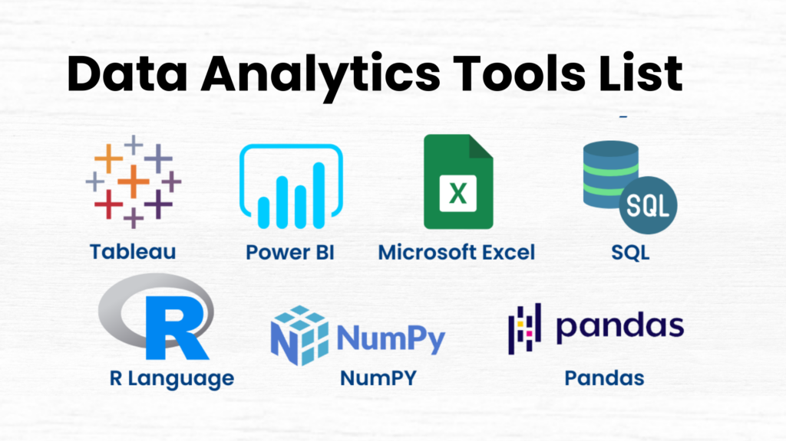

<h1 align="center">
  Hi there👋, I'm 
  <a href="https://linkedin.com/in/eric-inkoom-ayitey/" style="color:#3498db;" target="_blank">
    Eric Inkoom Ayitey
  </a>
</h1>

  <!-- Reference a GIF profile image uploaded to your repo, e.g., images/profile.gif -->
  

<ul>
  <li>A data analyst leveraging SQL, MS Excel, Power BI and Python to extract actionable insights from data</li>
  <li>Skills include:
    <ul>
      <li>Data Collection and Consolidation</li>
      <li>Data Assessment and Cleaning</li>
      <li>Data Modelling</li>
      <li>Data Analysis and Visualization</li>
      <li>Report Writing and Insights Communication</li>
    </ul>
  </li>
</ul>

## Tools 👩‍💻

<ul>
  <li>SQL (PostgreSQL, MySQL)</li>
  <li>MS Excel</li>
  <li>Power BI</li>
  <li>Python (Numpy, Pandas, Matplotlib, Seaborn)</li>
</ul>

  

  Reach me via email at <a href="mailto:ericinkoomayitey@gmail.com">ericinkoomayitey@gmail.com</a>

---

## Featured Projects

<table>
  <thead>
    <tr>
      <th>Project</th>
      <th>Tools</th>
      <th>Description</th>
    </tr>
  </thead>
  <tbody>
    <tr>
      <td><a href="https://github.com/Eric-Inkoom-Ayitey/8-Week-SQL-Challenge">8 Week SQL Challenge</a></td>
      <td>PostgreSQL</td>
      <td>
        Wrote SQL queries to find solutions to various business questions in various industries including:
        <ul>
          <li>health analytics</li>
          <li>marketing analytics</li>
          <li>people analytics</li>
          <li>financial markets</li>
          <li>fast moving consumer goods</li>
          <li>digital marketing</li>
        </ul>
      </td>
    </tr>
    <tr>
      <td><a href="https://github.com/Eric-Inkoom-Ayitey/data-wrangling-analysis">Data Wrangling and Analysis</a></td>
      <td>
        <ul>
          <li>Python (NumPy, Pandas, Matplotlib)</li>
          <li>Power BI</li>
        </ul>
      </td>
      <td>
        Gathered and analyzed tweets on dog ratings by <a href="https://twitter.com/WeRateDogs">WeRateDogs</a>. 
        Activities include:
        <ul>
          <li>gathering data from 3 sources</li>
          <li>assessing data</li>
          <li>cleaning data</li>
          <li>statistical analysis and visualizations</li>
          <li>deriving insights</li>
          <li>visualising insights on a Power BI report</li>
        </ul>
      </td>
    </tr>
    <tr>
      <td><a href="https://github.com/yourusername/show-noshow-medical-appointment">Investigating Show/NoShow to a medical appointment</a></td>
      <td>
        <ul>
          <li>NumPy</li>
          <li>Pandas</li>
          <li>Matplotlib</li>
        </ul>
      </td>
      <td>
        Performed exploratory data analysis to identify factors that are important to predict if a patient will show up for their medical appointment.
      </td>
    </tr>
    <tr>
      <td><a href="https://github.com/yourusername/ford-gobike-system-analysis">Ford GoBike System Data Analysis and Visualization</a></td>
      <td>
        <ul>
          <li>NumPy</li>
          <li>Pandas</li>
          <li>Seaborn</li>
        </ul>
      </td>
      <td>
        Performed exploratory data analysis by analyzing and visualizing univariate, bivariate and multivariate relationships between the variables in the data.
        Generated explanatory data visuals by formatting visuals to tell a story using the insights discovered during exploratory data analysis.
        Prepared a slide deck to display explanatory visuals.
      </td>
    </tr>
    <tr>
      <td><a href="https://github.com/yourusername/superstore-sales-report">Superstore Sales Report</a></td>
      <td>Power BI</td>
      <td>
        Analysis of the sales of a superstore over a period of 4 years
      </td>
    </tr>
  </tbody>
</table>

---

  

