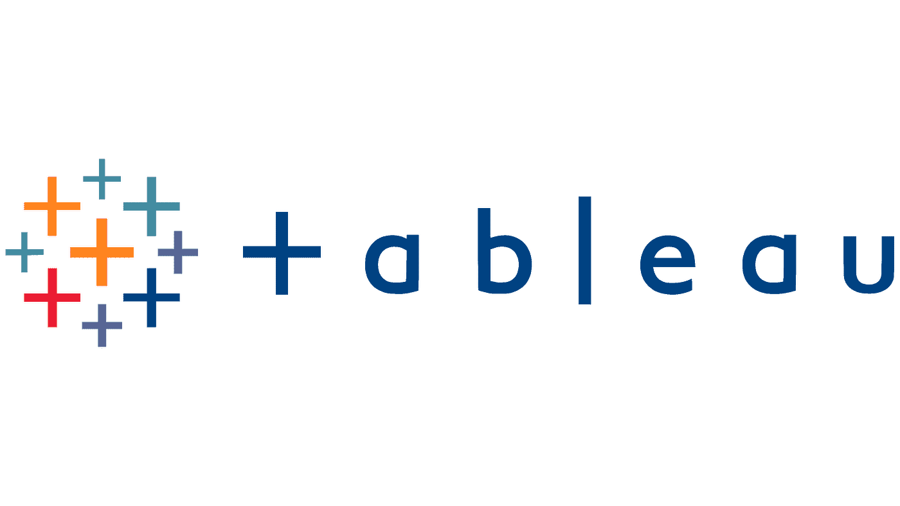

<h1 align="center">
  Hi there👋, I'm 
  <a href="https://linkedin.com/in/eric-inkoom-ayitey/" style="color:#3498db;" target="_blank">
    Eric Inkoom Ayitey
  </a>
</h1>

<ul>
  <li>A data analyst leveraging SQL, MS Excel, Power BI, Tableau, Python, and R to extract actionable insights from data</li>
  <li>Skills include:
    <ul>
      <li>Data Collection and Consolidation</li>
      <li>Data Assessment, Cleaning and Modelling</li>
      <li>SQL & Database Management</li>
       <li>Statistical & Analytical Thinking</li>
      <li>Report Writing and Insights Communication</li>
      <li>Business Analysis and Project Management</li>
      <li>Data Analysis and Visualization</li>
      <li>Python for Data Science</li>
      <li>Data Ethics, Data Literacy and Data Privacy</li>
    </ul>
  </li>
</ul>

  <!-- Reference a GIF profile image uploaded to your repo, e.g., images/profile.gif -->
  

## 🌐 Socials

  <!-- LinkedIn -->
  

  <!-- Medium -->
  

 <!-- Email -->
  

<h2>💻 Tech Stack</h2>

<table>
  <tr>
    <td>
      <h4>🧠 Programming & Scripting</h4>
      

        
        
        
        
        
        
        
        
      

    </td>
    <td style="width: 2px; background-color: gray;"></td>
    <td>
      <h4>📊 Data Science & ML</h4>
      

        
        
        
        
        
        
        
        
        
        
        
        
        
      

    </td>
  </tr>
  <tr>
    <td>
      <h4>🛠️ Developer Tools</h4>
      

        
        
        
        
        
        
        
      

    </td>
    <td style="width: 2px; background-color: gray;"></td>
    <td>
      <h4>🎨 Design & Docs</h4>
      

        
        
      

    </td>
  </tr>
  <tr>
    <td colspan="3">
      <h4>📈 Visualization</h4>
      

        
        
        
      

    </td>
  </tr>
</table>

<table>
  <tr>
    <td colspan="2">
      <!-- Most Used Languages -->
      
    </td>
  </tr>
  <tr>
    <td>
      <!-- GitHub Stats -->
      
    </td>
    <td>
      <!-- GitHub Streaks -->
      
    </td>
  </tr>
</table>

## 🏆 GitHub Trophies

### ✍️ Random Dev Quote

### 🔝 Top Contributed Repo

---

## Featured Projects

<table>
  <thead>
    <tr>
      <th>Project</th>
      <th>Tools</th>
      <th>Description</th>
    </tr>
  </thead>
  <tbody>
     <tr>
      <td><a href="https://github.com/Eric-Inkoom-Ayitey/Asthma-Prediction-App">Asthma Prediction App</a></td>
      <td>
        <ul>
          <li>Python (Pandas, Scikit-learn, Matplotlib)</li>
          <li>Streamlit</li>
        </ul>
      </td>
      <td>
        Developed and deployed an asthma prediction model using a synthetic health dataset to demonstrate intelligent screening, feature prioritization, and clinical decision support potential in resource-aware settings</a>. 
        Activities include:
        <ul>
          <li>Preprocessing 15 health-related features</li>
          <li>Visualizing key predictors</li>
          <li>Imputing missing values</li>
          <li>Building a fully serialized ML pipeline with RandomForestClassifier</li>
          <li>Deploying an interactive Streamlit app for live predictions</li>
          <li>Evaluating model performance (Accuracy: 94.7%, ROC AUC: 0.9909)</li>
        </ul>
      </td>
    </tr>
    <tr>
      <td><a href="https://github.com/Eric-Inkoom-Ayitey/Insurance-Project">Insurance Cost Factors Report</a></td>
      <td>Power BI</td>
      <td>
        Exploring the key factors influencing insurance costs using real-world data. It provides insights on health, lifestyle, demographics, and customer engagement attributes to support data-driven decision-making in insurance.
      </td>
    </tr>
    <tr>
      <td><a href="https://github.com/Eric-Inkoom-Ayitey/SQL-Queries">My SQL Queries</a></td>
      <td>MySQL</td>
      <td>
        Wrote SQL queries to find solutions to various business questions in various industries including:
        <ul>
          <li>health analytics</li>
          <li>marketing analytics</li>
          <li>people analytics</li>
          <li>financial markets</li>
          <li>fast moving consumer goods</li>
          <li>digital marketing</li>
        </ul>
      </td>
    </tr>
    <tr>
      <td><a href="https://github.com/yourusername/show-noshow-medical-appointment">Investigating Show/NoShow to a medical appointment</a></td>
      <td>
        <ul>
          <li>NumPy</li>
          <li>Pandas</li>
          <li>Matplotlib</li>
        </ul>
      </td>
      <td>
        Performed exploratory data analysis to identify factors that are important to predict if a patient will show up for their medical appointment.
      </td>
    </tr>
    <tr>
      <td><a href="https://github.com/yourusername/ford-gobike-system-analysis">Ford GoBike System Data Analysis and Visualization</a></td>
      <td>
        <ul>
          <li>NumPy</li>
          <li>Pandas</li>
          <li>Seaborn</li>
        </ul>
      </td>
      <td>
        Performed exploratory data analysis by analyzing and visualizing univariate, bivariate, and multivariate relationships between the variables in the data.
        Generated explanatory data visuals by formatting visuals to tell a story using the insights discovered during exploratory data analysis.
        Prepared a slide deck to display explanatory visuals.
      </td>
    </tr>
  </tbody>
</table>

---

  

